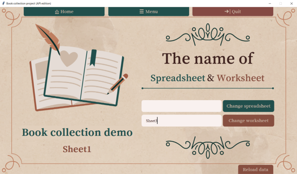

***
### Book Collection project (API edition)
The main objectives of this project are for concluding and 
applying all lessons of the Computer Programming II course, 
Kasetsart University. Another objective is for creating program 
which can help user to store, find and manage the data of their 
book collection.
***

## ♡ Description ♡

Book collection project is used for managing everything about 
my book collection data. Features of my application are adding, 
finding, filtering, updating, showing and processing the statistic 
of the books.

* Dataset will be used in the project is my book's collection 
  data on google sheet

* User can use all features that I just said. whether finding
  or filtering book from bookID, name, author or ISBN and also 
  processing the statistic of all books. For example; the number 
  of each book's category that in collection, the average of 
  books' rating in each publisher.

* About finding feature be visualized by picture and data of 
  that book. About filtering and showing book be visualized by 
  table of books. And about processing the statistic of the 
  books will be visualized by the charts.

[Here](https://docs.google.com/spreadsheets/d/1uVuDT3R_YHwmK951tJvQc7214SpfqblZlbYO9_wbgCs/edit#gid=0)
is the init book collection sheet.

 ***

## ♡ Features ♡
Book collection project is used for managing everything about my book collection
data. In this version I used Google sheet to be the database of application
that's why I call it "API edition". And These are main features in the application.

### ♡ Adding a book
\
In this feature, you can add more book into the collection and you
can browse picture file from `cover folder` that in `picApp folder` 
witch is come with all program(if your file isn't in this folder 
the picture willbe set to defalut picture).

### ♡ Editing book's detail
\
You can edit book by choose id of book that you want and edit it.
Then, hit the confirm edit button to edit book in database sheet.

### ♡ Finding a book
\
You can find the by choose from **BookID**, **Book's name(TH.)**
**Book's name(EN.)** and **ISBN**. And select the book you want 
to find in other combobox.

### ♡ Show all book
\
Show all book is used to see the column witch you select in checkbox
on the table, and you can sort it by what detail you choose in combobox

### ♡ Filter books
\
You can filter the book by whatever you choose from left combobox 
which are **author**, **publisher**, **category**, **status**, 
**location** and **cover**.

### ♡ Book's statistic
\
Can generate some statistic of book collection and show it as a graph.

### ♡ Change spreadsheet or worksheet
\
User can change spreadsheet or worksheet to access other
book collection which have same header of my collection.
And the collection sheet have to subscribe my service account
by sharing you sheet to my service account.
which you can copy from About me page. Following these
step:

### ♡ Show progress
\
When you loading data or doing some task which
take a moment to complete, Application will show
the progress bar on left down of app screen 
to let you know.

 ***
## ♡ Running the Application ♡
Open `bookApp.py` to run the application and required modules that
you need to download before running the program are in `requirements.txt` 
witch are:

* `pygsheets`: for manage every database in **google sheet**
* `pandastable`: create table in app.
* `pandas`: for ignore some warning of pandastable.
* `matplotlib`: create figure to plot graph.
* `seaborn`: for decorate graph.

I used `tkinter` to create all user interface and also used
`webbrowser`, `copy` and `threading` modules to manage some feature
in my application.

Note : I recommend you to run this application on **Windows** and 
download font `Song Myung` for **_better experience_**.
click [here](https://github.com/prog2022/project-ProudHokori/raw/main/picApp/SongMyung-Regular.ttf) 
to download font.

 ***
## ♡ Design ♡
Overall, I have 14 classes in my program. 2 for backend witch are 
`Book` for create each book object and `BookDatabase` to manage all data in app. 
And it has 12 classes for user interface. First,I used `BookApp` class 
to be main ui runner, and it can show each page that is inherited from `Page class`
witch are `HomePage`, `ChangeSheetPage`, `MenuPage`, `AddBookPage`,
`FindBookPage`, `EditBookPage`, `ShowBooksPage`, `FilterBookPage`,
`BookStatisticPage` and `AboutAppPage`. Each page will have their own
component and different command even their have same button in same position.

 ***
## ♡ Design Patterns Used ♡
I have about 2 major of design patterns in my app. 

The first is **Mediator** design pattern,
this design will lets you reduce chaotic dependencies between 
objects and forces them to collaborate only via a mediator object.
In my case, I used `BookApp class` to be the _mediator object_ and
used it for manage all page to raise UI (I used a class per page).

The second design pattern is **Template Method**. It's use to 
defines the skeleton of an algorithm in the superclass 
but lets subclasses override specific steps of the algorithm
without changing its structure. And in this case, I used 
`Page class` to be the superclass of each page in app. And
use some method from superclass just like _button_style_ or _init
background_.

 ***
## ♡ Other Information ♡
I have learned many things from this project. The first is about
reading and writing to Google Spreadsheets using Python. It's
quite new for me to access the data by using Google API but 
finally, I decided to use `pygsheeet` because their method
are on point with my project. 

The second thing isn't new, but I've learned many things that
help me to create the beautiful user interface like **figma** or
**powerpoint** to design the interface before code. and I mainly
used powerpoint to design and export all background picture in my
application.

---
####**Hope you have a great experience. Thank you. ʕ•́ᴥ•̀ʔっ**